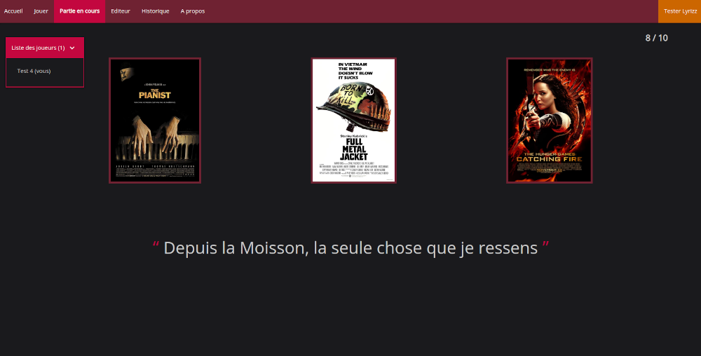
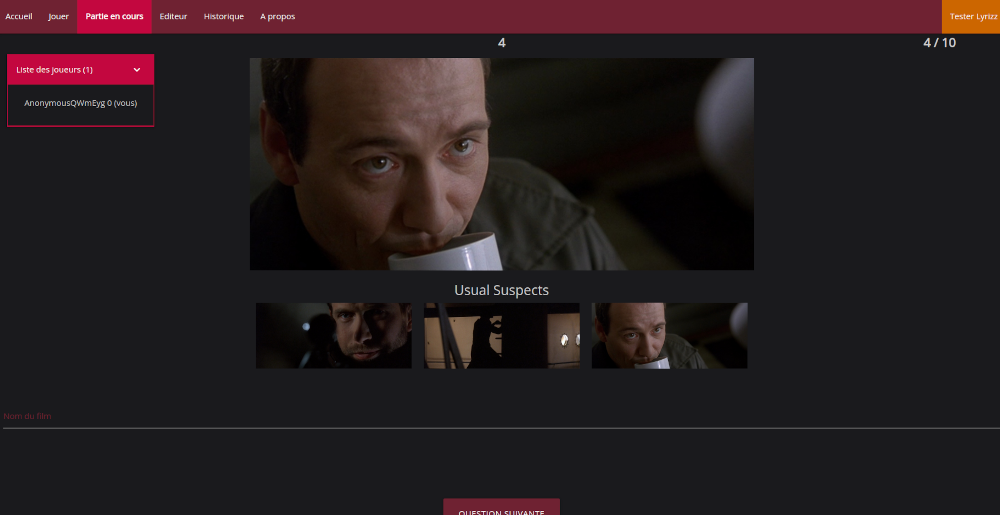
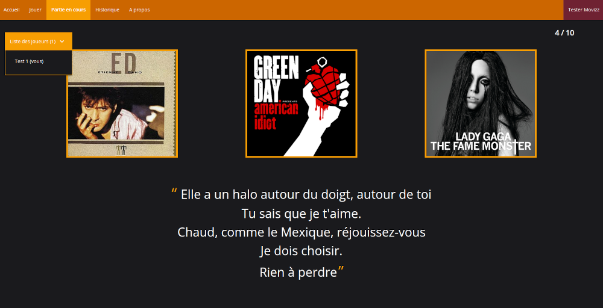

# Movizz and Lyrizz
This project consists of two online multiplayer games:
- **Movizz** where you have to find out from which film dialogues (or screenshots) come
- **Lyrizz** where you have to find out from which song lyrics come

## Common parts

### Technologies

- **[Django](https://www.djangoproject.com/)**: Python framework for making websites. It allows to easily generate views with templates and to manage the routing of URLS. The whole project was made with Django.
  - **[Django Channels](https://channels.readthedocs.io/en/stable/)**: A Django extension to manage websockets. Websockets are necessary here in order to have a multiplayer game with almost instantaneous interactions (so that all players see the questions at the same time).
- **[Gunicorn](https://gunicorn.org/)**: WSGI server to handle HTTPS requests (majority of the requests).
- **[Daphne](https://github.com/django/daphne)**: ASGI server to handle WSS requests (Websockets).
- **[Nginx](https://www.nginx.com/)**: Reverse proxy which receives requests and redirects them. It helps increase scalability, performance, resilience and security.
- **[MySQL](https://www.mysql.com/)**: Database to store movies, dialogues, songs, lyrics...
- **[Redis](https://redis.io/)**: NoSQL database used by Django Channel to store the necessary information required for different instances of consumers to communicate with one another.
- **[Materialize](https://materializecss.com/)**: Front-end framework

### Project architecture
The games were developed iteratively, so the overall architecture does not always have consistent names.
For example, the repository is called _movizz_ and the django project _guess\_movie_ but they correspond to the two games.

The project is divided into two applications: quizz (for movizz) and lyrizz. Here are the main folders of the project:

- **config_network/**: Configuration of Nginx, Gunicorn and Daphne on the server
- **guess_movie/**: Django project
  - **guess_movie/**: Common files
  - **lyrizz/**: Lyrizz application
  - **quizz/**: Movizz application
  - **media/**: To add with images (album covers, movie covers, screenshots)
  - **.env**: To add with your django secret key
  - **mysql_prod.cnf**: To add with your mysql configuration (only in prod)
- **notebooks/**: Notebooks used to extract all data (movies, dialogues, music, lyrics, ...)
- **redis.conf/**: Configuration of Redis

## Movizz
There are two game modes for movizz: 
- **Quote mode** where you have to find a movie among the three proposals from a quote

- **Image mode** where you have to find a film without proposals from three images (the faster you find it, the more points you get)

### Data
- [IMDb](https://www.imdb.com/), [Sens Critique](https://www.senscritique.com/): List of movies
- [IMDb](https://www.imdb.com/): Information about movies (Scrapped but there is an API)
- [OpenSubtitle](https://www.opensubtitles.org/fr): Dialogues in the form of French subtitles (API)
- [FilmGrab](https://film-grab.com/): Screenshot of movies for image mode (Scraped from the download button)

## Lyrizz

### Data
- [Spotify](https://www.spotify.com/): List of songs (manually entered playlists), API
- [Spotify](https://www.spotify.com/): Information about songs
- [Genius](https://genius.com/): Lyrics, API

## Important notice
Although the code is available, this project was not designed to be directly reusable.
Indeed, to deploy it on your own server you will have to adapt several parts that are specific to the configuration of my server.
Moreover, there is no dialogue/lyric data because it would overload the git repository (But I shared the notebooks used to extract them).